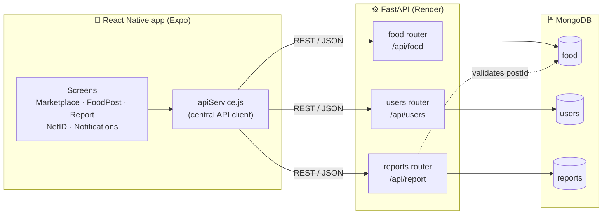
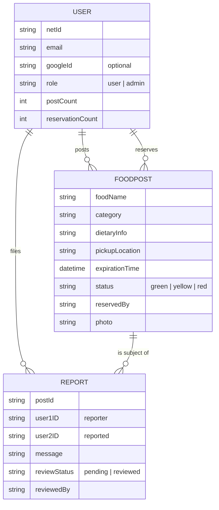
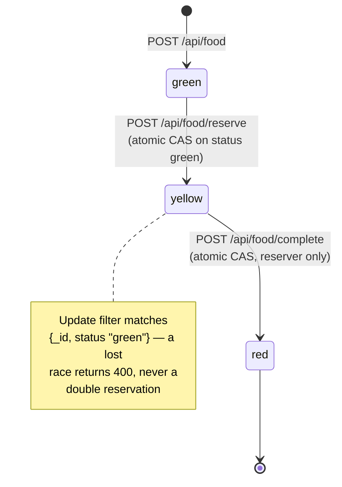
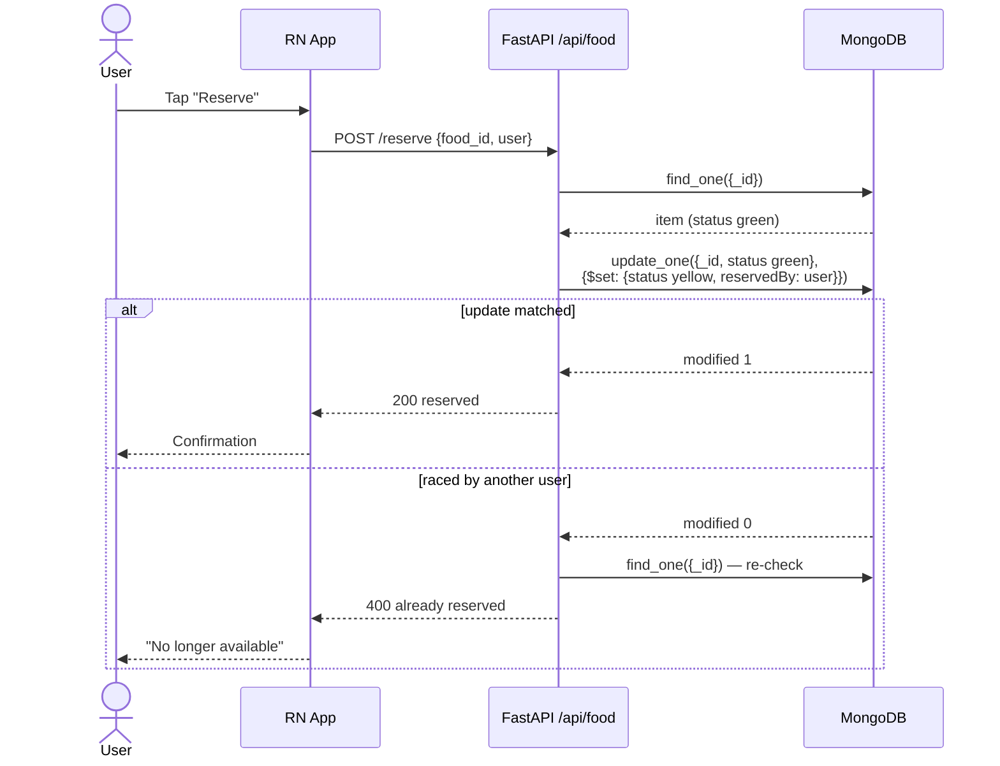

# CampusCraves 🍽️

A campus food-sharing platform that reduces food waste by letting students post surplus food, reserve items, and complete hand-offs — built as a full-stack software engineering class project by a team of four at NYU Abu Dhabi.

**Stack:** React Native (Expo) · FastAPI · MongoDB · deployed on Render

> This fork adds architecture documentation and repo hygiene on top of the original team repo ([bipana06/campusCraves](https://github.com/bipana06/campusCraves)).

## Why it's interesting

- **A concurrency-safe reservation protocol.** Food items move through a traffic-light lifecycle (`green` available → `yellow` reserved → `red` completed). State transitions use MongoDB *compare-and-set* updates — the update filter includes the expected current status — so two users racing to reserve the same item can't both win.
- **Authorization at the transition level.** Only the user who reserved an item may complete the transaction; the check happens server-side in the update filter, not just in the UI.
- **A moderation subsystem.** Users can report bad actors per post (with server-side "can this user report this post?" checks to prevent duplicates), and admins review reports through a pending → reviewed workflow.
- **Three auth paths** (email/password signup, Google sign-in, NYU NetID registration) converging on one user model.

## System architecture



## Domain model



## Reservation lifecycle



## Reserve flow, end to end



## API surface

| Area | Endpoint | Purpose |
|---|---|---|
| Food | `POST /api/food` | Create a post (multipart, photo upload) |
| | `GET /api/food` | List marketplace posts |
| | `GET /api/food/search` | Filtered search |
| | `POST /api/food/reserve` | Reserve (green → yellow, atomic) |
| | `POST /api/food/complete` | Complete hand-off (yellow → red, reserver only) |
| | `GET /api/food/poster-netid/{id}` | Look up poster's NetID |
| Users | `POST /api/users/signup` · `/email-login` · `/auth-check` | Email auth |
| | `POST /api/users/register` | Google / NetID registration |
| | `GET /api/users/profile/{net_id}` | Profile with post & pickup history |
| Reports | `POST /api/report` | File a report |
| | `GET /api/report/can-report/{post}/{user}` | Duplicate-report guard |
| | `PUT /api/report/{id}` | Admin review (pending → reviewed) |
| | `GET /api/reports` | Admin list |

## Testing

The backend ships with a pytest suite (`CC-backend/tests/`) covering the food, user, and report routers plus database and utility layers, with fixtures in `conftest.py`.

```bash
cd CC-backend && pip install -r requirements.txt && pytest
```

## Running locally

**Frontend** (Expo):

```bash
cd frontend && npm install && npx expo start
```

**Backend** (FastAPI + MongoDB):

```bash
cd CC-backend
python -m venv campusenv && source campusenv/bin/activate
pip install -r requirements.txt
uvicorn main:app --reload
```

Set the MongoDB connection string in `CC-backend/.env` (see `database.py`).

## Team

Built by **Manoj Dhakal**, **Komal Neupane**, **Bipana Bastola**, and **Aabaran Paudel** for a Software Engineering course at NYU Abu Dhabi.
